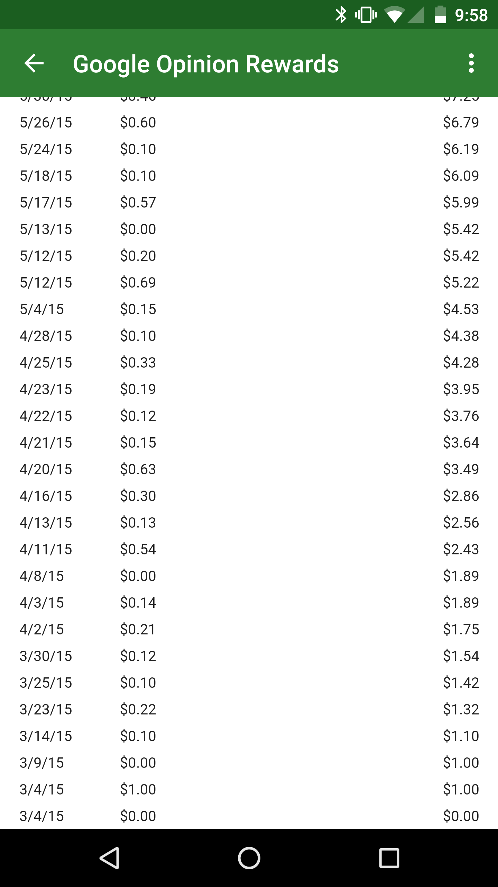

# Scraping Screenshots of Google Opinion Rewards Data

Google Opinion Rewards lets you view your reward history within the Android app, but only as an image and with no way to export to a text format. 

Since images of tabular data are a common annoyance it seemed like it could be interesting to use OCR to exract this data and possibly reuse for something else later. 

This script uses tesseract-ocr and python to extract the data from screenshots and format into a csv file.

------------------------
### Note: [tesseract](https://github.com/tesseract-ocr/tesseract) is required in order for this to work.

 I am not sure if a Windows version of tesseract is available, but the following will install tesseract on Debian Linux distros:
 
 ```
 sudo apt-get install tesseract-ocr
 ```
 
 This script is written for python 3x, but could easily be modified for python 2x if needed.
 
 The required python packages are all standard library and this was able to run on a Raspberry Pi.
 
 --------------------
### To try it out:
* Take screen shots of your rewards history data and put them in the ./screenshots directory



* Run:
```
python ./get_rewards_data.py
```
* A timestamped csv file will be placed placed in the current directory